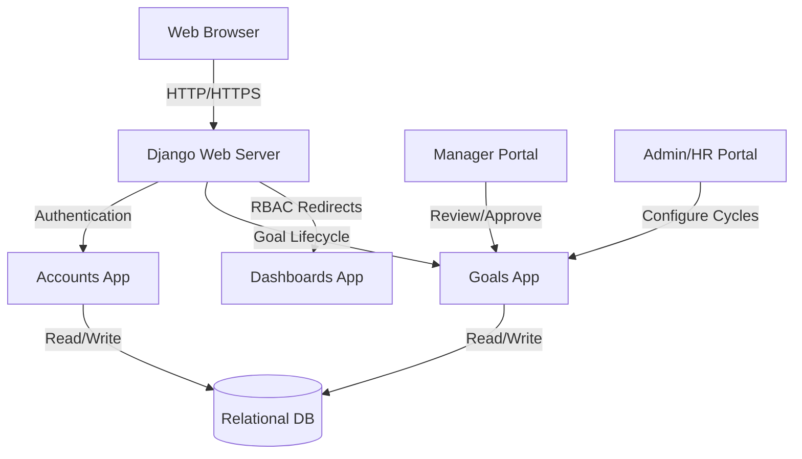

# GoalTrack Portal

GoalTrack is a structured, digital Goal Setting & Tracking Portal built for the hackathon/project requirement.

## Architecture

This project is built using a monolithic architecture:
- **Backend Framework:** Django (Python) - Chose for its robust ORM, built-in admin, and security features (CSRF/XSS protection).
- **Database:** SQLite (dev) / PostgreSQL (production) - Storing complex relations between Users, Goals, and Cycles.
- **Frontend:** Server-Side Rendered (SSR) Django Templates using vanilla CSS (Scribble UI / Traveloop Design System).
- **Hosting Choice (Recommended):** Deploy on Render or Heroku using Gunicorn and WhiteNoise for static files. The PostgreSQL addon handles data.



## Running the Demo Locally

1. **Activate Environment & Run Server:**
   ```bash
   .\venv\Scripts\activate
   python manage.py runserver
   ```

2. **Test Credentials:**
   We have created 3 users to test the full lifecycle:
   - **Admin:** `admin` / `pass`
   - **Manager:** `manager` / `pass`
   - **Employee:** `employee` / `pass`

3. **User Journey:**
   - Login as `employee`, create a Goal Sheet under "FY25-26 Phase 1". Add goals summing to 100%. Submit for approval.
   - Logout, login as `manager`. Go to "Review Team Goals", see the submitted sheet, adjust weightages if necessary, and Approve.
   - Login as `admin` to oversee the portal components.
