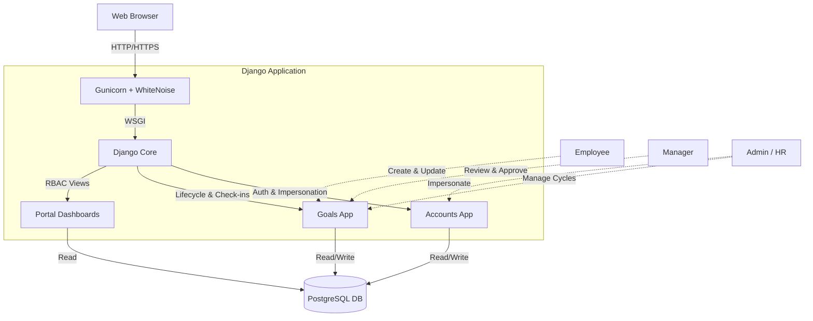

# GoalTrack Portal

GoalTrack is a modern, structured, and digital Goal Setting & Tracking Portal built to eliminate the pain points of offline spreadsheets and fragmented goal reviews. It supports the full lifecycle of employee goals—from creation and alignment to quarterly check-ins and performance visibility.

### Live Demo
**[https://goal-portal-lxyt.onrender.com/](https://goal-portal-lxyt.onrender.com/)**

---

## Key Features

- **Role-Based Access Control (RBAC)**: Secure, customized portals for Employees, Managers, and Admins/HR.
- **Phase-Based Lifecycle**: Strict control over "Goal Setting" vs "Check-in" phases via Admin Goal Cycles.
- **Automated Validation**: Ensures goal weightages sum to exactly 100% before submission.
- **Manager Workflows**: Managers can review, adjust weightages, approve, or return goal sheets with remarks.
- **Impersonation**: Admins can impersonate any user to troubleshoot issues or view the system from their perspective.
- **Audit Logs**: Complete transparency into who approved or modified a goal sheet and when.
- **Quarterly Check-ins**: Granular tracking of actuals, statuses (On Track, Completed), and manager comments.

---

## Architecture

GoalTrack is built using a monolithic server-side rendered (SSR) architecture, ensuring high security (CSRF/XSS protection), rapid development, and a deeply integrated ORM.



---

## 🛠️ Technology Stack

- **Backend**: Python 3.10+, Django 5.2.14
- **Database**: PostgreSQL (Production) / SQLite (Local Development)
- **Frontend**: Vanilla HTML/CSS utilizing the custom "Scribble" Design System (CSS Grid/Flexbox, custom CSS tokens).
- **Deployment**: Render (Web Service), Gunicorn (WSGI Server), WhiteNoise (Static Files)

---

## Running Locally & Demo Data

1. **Clone & Setup Environment:**
   ```bash
   git clone [<repo-url>](http://github.com/kashish2210/goal-portal)
   cd goal-portal
   python -m venv venv
   source venv/Scripts/activate  # Windows
   pip install -r requirements.txt
   ```

2. **Configure Environment:**
   Create a `.env` file from `.env.example`:
   ```bash
   cp .env.example .env
   # Ensure DEBUG=True for local testing
   ```

3. **Run Migrations & Seed Data:**
   GoalTrack includes a comprehensive script to generate realistic departments, goal cycles, goal sheets, and check-ins.
   ```bash
   python manage.py migrate
   python manage.py seed_demo_users
   python manage.py runserver
   ```

### Demo Credentials

All seeded demo accounts share the password: **`1234@abcd`**

| Role | Username | Department | Description |
|---|---|---|---|
| **Admin** | `admin` | HR & Admin | Full system access, cycle management, impersonation. |
| **Manager** | `manager` | Engineering | Manages Priya & Arjun. Has pending reviews. |
| **Manager** | `manager2` | Sales | Manages Kavya & Rahul. |
| **Employee** | `employee` | Engineering | Goal sheet is Approved. Has Q1 achievements. |
| **Employee** | `kavya.mehta` | Sales | Goal sheet is Approved. Outstanding Q1 review. |
| **Employee** | `rahul.das` | Sales | Goal sheet Returned for revision. |
| **Employee** | `arjun.nair` | Engineering | Goal sheet Submitted, pending manager approval. |

---

## Security Highlights
- Django's built-in session framework securely handles Admin impersonation without leaking credentials.
- Static assets are securely served and cache-busted using WhiteNoise in production.
- Environment variables isolate production secrets (DB URL, Secret Key) from the codebase.
